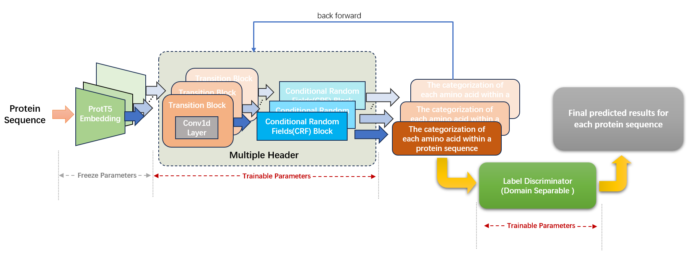

# Unraveling the Mystery: Predicting the Function, Domain, and GO Term of Each Amino Acid in the Protein Sequence

Work is in progress......                    
            
           
## About Dataset (Interpro database)

**Preprocessing Details**

Interpro database ([version 97.0](https://ftp.ebi.ac.uk/pub/databases/interpro/current_release/)) contains 40562 entries
and multiple protein function databases. In MetaAI project, the part of protein function prediction focuses on protein
family, domain, GO terms and EC number, etc.
In interpro, we preprocessed the `Interpro.xml` file to get the associations between each interpro entry and
corresponding different databases (output file is `Interpro_out.txt`).

In addition, we preprocessed the `match_complete.xml` file to obtain the associations between each protein and
corresponding different databases and interpro entries (output file is `match_complete_out.txt`).     
After that, we processed the `match_complete_out.txt` to obtain subfiles with protein ids and corresponding labels for
each database, and matched corresponding sequences with protein ids
in [uniref100](https://ftp.uniprot.org/pub/databases/uniprot/uniref/uniref100/Uniref100.fasta.gz).

Thus, the result file contains protein id, sequence, and label is obtained. Up to now, we have completed the processing
of `PFAM`, `GENE3D` and `GO` databases.
                        
---            
In order to transform the proteins functional annotation into Named Entity Recognition (NER) task, here we assign
functional labels with a unique id, and then correspond each amino acid position in the amino acid fragment where the
label of each protein is located with a label id to obtain a label id applied to the NER task.                    
For convenience, we store each protein sequence and corresponding label (Protein Family/Protein domain/GO Terms) as a
pickle file, and named with `"PROTEIN_ID.pkl""`. For each pickle file contain `seq`, `token_label`, `start` and `end`
fields. We use `BIO` strategy to generate labels for NER tasks.
> **Protein Family:** Contains `163,353,266` protein sequences and `20,795` PFAM families. We divided the data set
> into `three` groups according to the length of the protein sequence,
> namely `less than 250`, `greater than or equal to 250 and less than 500`,
> and `greater than or equal to 500`.               
> The preprocessed pickle file is stored in `/home/share/huadjyin/home/zhangchao5/dataset/version2/pfam/pkls`, which
> contains `20,975` folders.

<table>
<tr>
<th>group name</th>
<th>sequence number</th>
<th>PFAM number</th>
</tr>
<tr>
<td style="width: 50px; text-align: center">seq<250</td>
<td style="width: 50px; text-align: center">54,153,989</td>
<td style="width: 50px; text-align: center">20,414</td>
</tr>
<tr>
<td style="width: 50px; text-align: center">seq>=250, seq<500</td>
<td style="width: 50px; text-align: center">98,803,842</td>
<td style="width: 50px; text-align: center">18,654</td>
</tr>
<tr>
<td style="width: 50px; text-align: center">seq>=500</td>
<td style="width: 50px; text-align: center">82,649,256</td>
<td style="width: 50px; text-align: center">16,795</td>
</tr>
</table>

> **Protein domain:** Contains `***` protein sequences and `***` GENE3D labels. We divided the data set into `***`
> groups according to the length of the protein sequence, namely `***`, `***`, and `***`.           
> The preprocessed pickle file is stored in `***`, which contains `***` folders.
>
> **GO terms:** Contains `***` protein sequences and `***` Go-TERMs. We divided the data set into `***` groups according
> to the length of the protein sequence, namely `***`, `***`, and `***`.       
> "The preprocessed pickle file is stored in `***`, which contains `***` folders.

## Training

**1. PFAM**
> - Firstly, we selected `500` protein families from the data with protein sequence length `less than 250` to form a
    subset (`57,428,979` protein sequence) and used it for model training.
> - For the preprocessing, we filtered the protein_id that appeared in the `protein vec` and `protein enn` test sets,
    and we randomly selected 10,000 protein sequences from each protein family.
> - Each group contains 4 files,
>      - `label.*.txt`: the protein families contained in the current group.
>      - `label2id.sub500.*.pkl`: a mapping file that converts protein family names to numeric values.
>      - `sub500.*.train.txt`: train set file.
>      - `sub500.*.test.txt`: test set file.
> - All group files are saved in `/home/share/huadjyin/home/zhangchao5/dataset/version2/pfam/filtered/less250/subgroup`.           
             
<table>
<tr>
<td style="width: 140px; text-align: center">Subgroup ID</td>
<td style="width: 50px; text-align: center">sub01</td>
<td style="width: 50px; text-align: center">sub02</td>
<td style="width: 50px; text-align: center">sub03</td>
<td style="width: 50px; text-align: center">sub04</td>
<td style="width: 50px; text-align: center">sub05</td>
<td style="width: 50px; text-align: center">sub06</td>
<td style="width: 50px; text-align: center">sub07</td>
<td style="width: 50px; text-align: center">sub08</td>
<td style="width: 50px; text-align: center">sub09</td>
<td style="width: 50px; text-align: center">sub10</td>
</tr>
<tr>
<td style="width: 140px; text-align: center">Sequence Number</td>
<td style="width: 50px; text-align: center">5,000,000</td>
<td style="width: 50px; text-align: center">5,000,000</td>
<td style="width: 50px; text-align: center">4,509,237</td>
<td style="width: 50px; text-align: center">3,009,794</td>
<td style="width: 50px; text-align: center">2,164,927</td>
<td style="width: 50px; text-align: center">1,663,997</td>
<td style="width: 50px; text-align: center">1,325,056</td>
<td style="width: 50px; text-align: center">1,101,323</td>
<td style="width: 50px; text-align: center">913,494</td>
<td style="width: 50px; text-align: center">757,898</td>
</tr>
</table>

<table>
<tr>
<td style="width: 140px; text-align: center">Subgroup ID</td>
<td style="width: 50px; text-align: center">sub11</td>
<td style="width: 50px; text-align: center">sub12</td>
<td style="width: 50px; text-align: center">sub13</td>
<td style="width: 50px; text-align: center">sub14</td>
<td style="width: 50px; text-align: center">sub15</td>
<td style="width: 50px; text-align: center">sub16</td>
<td style="width: 50px; text-align: center">sub17</td>
<td style="width: 50px; text-align: center">sub18</td>
<td style="width: 50px; text-align: center">sub19</td>
<td style="width: 50px; text-align: center">sub20</td>
</tr>
<tr>
<td style="width: 140px; text-align: center">Sequence Number</td>
<td style="width: 50px; text-align: center">637,885</td>
<td style="width: 50px; text-align: center">544,660</td>
<td style="width: 50px; text-align: center">466,699</td>
<td style="width: 50px; text-align: center">400,039</td>
<td style="width: 50px; text-align: center">344,992</td>
<td style="width: 50px; text-align: center">298,799</td>
<td style="width: 50px; text-align: center">257,494</td>
<td style="width: 50px; text-align: center">221,680</td>
<td style="width: 50px; text-align: center">191,618</td>
<td style="width: 50px; text-align: center">165,233</td>
</tr>
</table>

<table>
<tr>
<td style="width: 140px; text-align: center">Subgroup ID</td>
<td style="width: 50px; text-align: center">sub21</td>
<td style="width: 50px; text-align: center">sub22</td>
<td style="width: 50px; text-align: center">sub23</td>
<td style="width: 50px; text-align: center">sub24</td>
<td style="width: 50px; text-align: center">sub25</td>
<td style="width: 50px; text-align: center">sub26</td>
<td style="width: 50px; text-align: center">sub27</td>
<td style="width: 50px; text-align: center">sub28</td>
<td style="width: 50px; text-align: center">sub29</td>
<td style="width: 50px; text-align: center">sub30</td>
</tr>
<tr>
<td style="width: 140px; text-align: center">Sequence Number</td>
<td style="width: 50px; text-align: center">142,445</td>
<td style="width: 50px; text-align: center">122,927</td>
<td style="width: 50px; text-align: center">105,192</td>
<td style="width: 50px; text-align: center">89,910</td>
<td style="width: 50px; text-align: center">77,439</td>
<td style="width: 50px; text-align: center">67,103</td>
<td style="width: 50px; text-align: center">58,283</td>
<td style="width: 50px; text-align: center">50,247</td>
<td style="width: 50px; text-align: center">43,137</td>
<td style="width: 50px; text-align: center">36,622</td>
</tr>
</table>

<table>
<tr>
<td style="width: 140px; text-align: center">Subgroup ID</td>
<td style="width: 50px; text-align: center">sub31</td>
<td style="width: 50px; text-align: center">sub32</td>
<td style="width: 50px; text-align: center">sub33</td>
<td style="width: 50px; text-align: center">sub34</td>
<td style="width: 50px; text-align: center">sub35</td>
<td style="width: 50px; text-align: center">sub36</td>
<td style="width: 50px; text-align: center">sub37</td>
<td style="width: 50px; text-align: center">sub38</td>
<td style="width: 50px; text-align: center">sub39</td>
<td style="width: 50px; text-align: center">sub40</td>
</tr>
<tr>
<td style="width: 140px; text-align: center">Sequence Number</td>
<td style="width: 50px; text-align: center">30,614</td>
<td style="width: 50px; text-align: center">25,366</td>
<td style="width: 50px; text-align: center">20,825</td>
<td style="width: 50px; text-align: center">16,680</td>
<td style="width: 50px; text-align: center">13,0722</td>
<td style="width: 50px; text-align: center">9,824</td>
<td style="width: 50px; text-align: center">6,996</td>
<td style="width: 50px; text-align: center">4,680</td>
<td style="width: 50px; text-align: center">2,823</td>
<td style="width: 50px; text-align: center">1,433</td>
</tr>
</table>

## Metrics

**1. Token Level**          
$$Accuracy=\frac{CorrectlyClassifiedTokens}{TotalTokens}$$

**2. Entity Level**      
$$Precision=\frac{CorrectlyClassifiedEntities}{PredictedEntities}$$

**3. Recall (Entity Level)**       
$$Recall=\frac{CorrectlyClassifiedEntities}{ActuallyEntities}$$

**4. Mean Intersection over Union (mIoU)**                       
The mIoU calculation formula for each predicted entity is as follows,           
$$*******$$

## Declaration

This is not an official document, please do not distribute it externally.       
            
            
